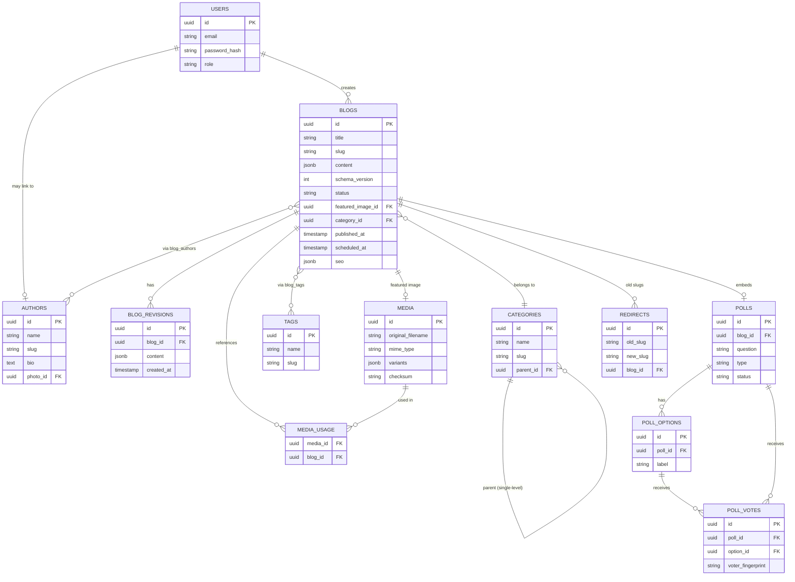
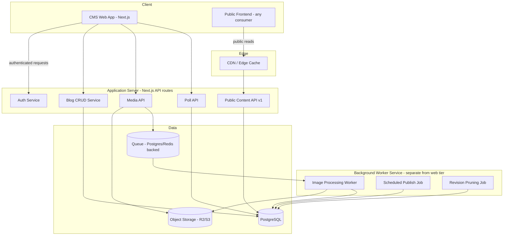
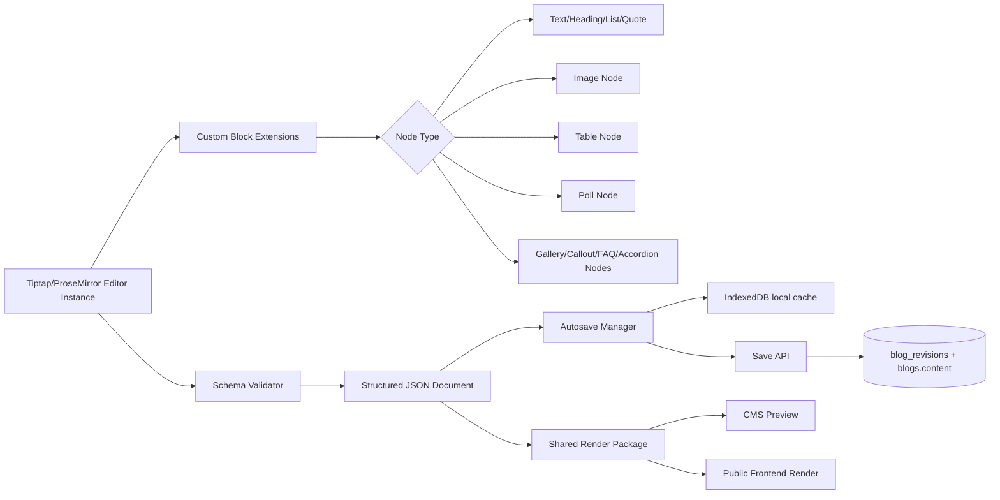
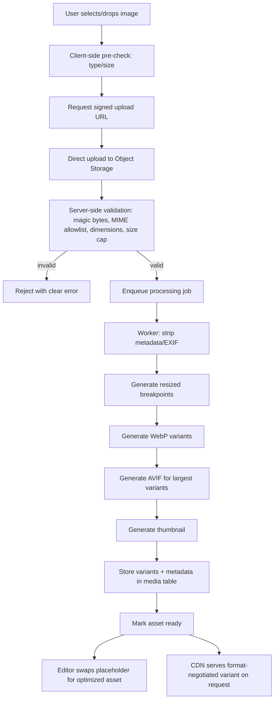
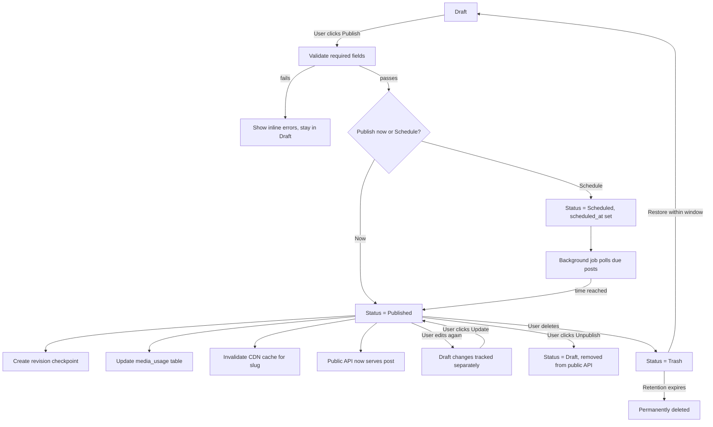

# Product Requirements Document
## OpenPost
### Professional Blog CMS & Writing Studio

**Document status:** Draft v1.0
**Prepared for:** Engineering, Design, and AI coding agents
**Audience:** Full-stack engineering team, individual founder/developer, or autonomous coding agent implementing this system from scratch

---

## Table of Contents

1. Product Overview
2. Product Vision
3. Goals
4. Non-Goals
5. Target Users & Personas
6. User Stories
7. User Journeys
8. Product Architecture
9. Version Roadmap (V1–V4)
10. Editor Specification
11. Content Blocks
12. Image System
13. Media Library
14. Blog Management
15. Publishing System
16. SEO System
17. Poll System
18. Categories & Tags
19. Authors
20. Revision History
21. API / Headless CMS
22. Database Design
23. Authentication
24. Authorization / Roles & Permissions
25. Security
26. Performance
27. Accessibility
28. Responsive Design
29. Error Handling
30. Notifications
31. Settings
32. Screen Inventory
33. Technical Architecture & Stack
34. Testing Strategy
35. Acceptance Criteria (representative)
36. Technical Risks
37. Prioritization (MVP Matrix)
38. Development Phases
39. Future Roadmap
40. Launch Checklist
41. Diagrams (Mermaid)

---

## 1. Product Overview

OpenPost is a professional, blog-focused Content Management System and writing studio. It combines the writing ergonomics of Microsoft Word / Google Docs, the structural clarity of Notion's block model, and the publishing/SEO discipline of a professional CMS like WordPress or Sanity — without copying any of them directly.

It is built for people and teams who write and publish blog content regularly and need more control, structure, and reliability than a generic document editor, but less overhead and complexity than a full enterprise CMS or website builder.

The system separates cleanly into three layers:

- **Writing Studio** — the rich, block-based editor where content is authored.
- **CMS / Management Layer** — dashboards for organizing, scheduling, and publishing blog content (categories, tags, authors, media, SEO).
- **Delivery Layer** — a versioned, headless API that any frontend (owned or third-party) can consume to render published content publicly.

---

## 2. Product Vision

To be the most reliable, focused writing-and-publishing tool for professional blogging — an application where a writer never loses work, where structured content never breaks as the product evolves, and where publishing a well-optimized, well-structured blog post requires no technical knowledge.

The product intentionally stays narrow: it is **not** a website builder, **not** a general CMS, and **not** a marketing suite. Everything is justified by one question: *does this make writing, organizing, or publishing blog content better?*

### Guiding principles

| # | Principle |
|---|---|
| 1 | Simple for beginners, powerful for professionals |
| 2 | Fast and responsive at all times |
| 3 | Clean, modern, minimal interface |
| 4 | Mobile-friendly dashboard; desktop-first editor |
| 5 | Autosave everywhere; never lose user work |
| 6 | Strong accessibility by default |
| 7 | Strong security by default |
| 8 | SEO-friendly content structure |
| 9 | Extensible, block-based architecture |
| 10 | Avoid unnecessary complexity |
| 11 | Editor should feel familiar to Word/Docs users |
| 12 | Stay focused on blogging, not generic enterprise CMS |

---

## 3. Goals

- Let a non-technical user create, format, and publish a professional blog post in minutes.
- Provide a block-based content model that is structured, versionable, and safe to render (no raw HTML trust boundary issues).
- Provide professional image handling: upload, optimize, resize, position, caption, alt-text.
- Provide CMS fundamentals: drafts, scheduling, categories, tags, authors, revisions, trash/restore.
- Provide a dedicated SEO panel with actionable, honest warnings (not ranking guarantees).
- Provide a public, cache-friendly, versioned API so any website frontend can consume published content headlessly.
- Guarantee that user content is never silently lost (autosave + recovery + revisions).
- Ship in four clearly scoped versions (V1–V4) that are each independently useful.

## 4. Non-Goals (see also §39 Out of Scope)

- Not a full website builder or page builder.
- Not a WordPress replacement (no plugin ecosystem, themes marketplace).
- Not e-commerce, not a CRM, not an email marketing tool.
- Not a full visitor-analytics platform (only internal CMS metrics in V1–V4).
- Not a real-time multiplayer collaborative editor in V1–V4 (explicitly future scope).
- Not a general-purpose document tool (contracts, spreadsheets, slides) — blog content only.

---

## 4A. Target Users

- Individual bloggers and independent writers
- Website owners who need a content backend
- SEO specialists / content marketers
- Content creators and creator-economy writers
- Small businesses publishing regular content
- Marketing teams at small-to-mid companies
- Agencies managing blogs for multiple clients
- Developers who want a headless blog CMS behind their own frontend

### Personas

**Priya — Independent Blogger.** Not technical. Wants a Word-like writing experience, worry-free autosave, and one-click publish. Cares about images looking good and not needing to think about SEO deeply, just get warned if something's missing.

**Marcus — SEO/Content Marketer at a startup.** Publishes 3–5 posts/week across a small team. Needs categories, tags, scheduling, SEO metadata control, and a dashboard that shows what's in the pipeline.

**Dana — Freelance Developer.** Builds custom Next.js frontends for clients. Wants a headless CMS with a clean API, predictable content schema, and no vendor lock-in on rendering.

**Owen — Agency Ops Lead.** Manages multiple authors and clients. Needs roles/permissions so contributors can't publish without review, and a trash/restore safety net for mistakes.


---

## 5. User Stories

**Writing & Editing**
- As a blogger, I want to create a draft so that I can continue writing later.
- As a writer, I want autosave so that I never lose work if my browser crashes.
- As a writer, I want familiar formatting shortcuts (Ctrl+B, Ctrl+I) so the editor feels like Word/Docs.
- As a writer, I want to insert and resize images inline so my post looks professional without leaving the editor.
- As a writer, I want images automatically optimized so my blog loads faster without me doing anything.
- As an editor, I want to insert a poll so readers can interact with my article.
- As a writer, I want a slash command menu so I can quickly insert blocks without touching my mouse.

**Management & Publishing**
- As a blogger, I want a dashboard showing drafts, published, and scheduled posts so I know my pipeline at a glance.
- As a writer, I want to preview my post on desktop/tablet/mobile before publishing so I know it looks right everywhere.
- As a blogger, I want to schedule a post for a future date so it publishes automatically.
- As a blogger, I want to restore a previous revision so I can undo a bad edit from days ago.
- As a blogger, I want deleted posts to go to Trash (not disappear instantly) so I can recover mistakes.

**SEO & Organization**
- As a marketer, I want an SEO panel with warnings so I don't forget a meta description or alt text.
- As a blogger, I want automatic slug generation with manual override so URLs stay clean and SEO-friendly.
- As a blogger, I want categories and tags so readers and search engines can navigate my content.

**Admin & Security**
- As an administrator, I want role-based permissions so contributors cannot change system settings or publish without review.
- As an administrator, I want to see where a media asset is used before deleting it so I don't break a live post.
- As a developer, I want a versioned public API so I can build my own frontend against stable content contracts.

---

## 6. User Journeys

**Journey 1 — New user creates first blog post**
Sign up → onboarding (optional) → Dashboard (empty state, "+ New Blog") → editor opens with empty draft → user writes title (slug auto-generates) → writes content using toolbar/slash menu → adds featured image → autosave triggers silently → user opens SEO panel, sees warnings, fills fields → clicks Preview → satisfied → clicks Publish → confirmation → redirected to Published list, sees new post.

**Journey 2 — Editing a published post**
Dashboard → Published list → click post → editor opens with current published version → user edits → status implicitly becomes "Published (unsaved changes)" → autosave stores a draft revision alongside live version → user clicks "Update" → live version replaces old, old version archived to revision history.

**Journey 3 — Scheduling a post**
Editor → Publish menu → "Schedule" → date/time picker (respects user's timezone) → confirm → post moves to Scheduled list → background job publishes automatically at target time → notification confirms publish.

**Journey 4 — Restoring a revision**
Editor → "History" panel → list of revisions with timestamp + author → select revision → diff/preview shown → "Restore this version" → confirmation modal (since it overwrites current draft content, not published content directly) → restored into editor as the working draft.

**Journey 5 — Managing media**
Media Library → grid view → search/filter → click asset → detail panel shows metadata + "Used in: Post A, Post C" → attempt delete → if in use, warning modal listing usages → confirm or cancel.

Other journeys (insert poll, change slug, manage SEO, admin creates author, etc.) follow the same pattern: **entry point → action → immediate feedback → safe reversible state change.** Full journey specs for all 14 flows listed in the source prompt follow this same template and are implemented per-screen in §32.

---

## 7. Product Architecture (High Level)

Three-layer separation, communicating only through well-defined contracts:

1. **Writing Studio (Editor)** — client-side rich editor (Tiptap-based) producing a structured JSON document (see §11, §22 Content Architecture), not raw HTML.
2. **CMS Application** — Next.js app (dashboard, editor shell, media library, settings) talking to a REST/JSON API backed by PostgreSQL.
3. **Public Content API** — versioned, read-only, cache-friendly endpoints serving only published content, consumed by any frontend (including a possible companion site product, or third-party frontends).

Background workers handle: image processing pipeline, scheduled publishing, search indexing, and revision pruning — kept asynchronous and decoupled from the request path so the editor never blocks on heavy work.


---

## 8. Version Roadmap

### V1 — Core Blog Editor

**Goal:** A reliable, professional writing experience. Nothing about publishing/CMS yet beyond the minimum needed to save and view a post.

**Scope:** Rich text (headings, bold/italic/underline/strike, alignment, ordered/unordered/checklists, blockquote, links, horizontal rule, code block, inline code), undo/redo, keyboard shortcuts, copy/paste, drag-and-drop, image insertion/resize/align, tables, captions, autosave, draft saving, preview, publish (single-step, no scheduling yet).

**Editor foundation:** Built on **Tiptap** (ProseMirror-based). Rationale in §33 — mature, extensible, schema-enforced, avoids building a text engine from scratch which is a large, high-risk undertaking with poor ROI versus using proven infrastructure.

**Acceptance:** A user can write a formatted post with an image and a table, have it autosave, preview it, and publish it — with zero technical knowledge.

### V2 — Blog Management & Publishing

**Goal:** Turn the editor into a CMS. Adds the dashboard, content states, organization, and SEO metadata.

**Scope:** Dashboard (Drafts/Published/Scheduled/Trash), categories, tags, authors, featured image, slug, SEO title/meta description/canonical/OG/Twitter card, publish/updated dates, reading time, word count, public/private status, scheduled publishing, search/filter/sort/pagination, content status management.

**Acceptance:** A user can organize 50+ posts, find any post in under 5 seconds via search/filter, and schedule a post to auto-publish at a future date reliably.

### V3 — Advanced Content Blocks

**Goal:** Move from "rich text with images" to a true block-based composition system.

**Scope:** Block types — text, heading, image, gallery, quote, callout, poll, table, video, YouTube embed, divider, button, FAQ, accordion, code, download, social embed. Slash-command (`/`) insertion menu. Each block is independently defined, validated, and rendered (see §11 for full per-block spec).

**Acceptance:** A user can build a post that mixes 6+ block types, including a poll and an FAQ accordion, entirely via the `/` menu, with each block rendering identically in editor preview and on the public frontend.

### V4 — Professional Media System

**Goal:** Production-grade image pipeline and media library.

**Scope:** Upload validation (MIME/size/dimensions), server-side processing, WebP/AVIF generation, responsive resized variants, thumbnails, metadata storage, media library UI (search/filter/sort/grid/list), usage tracking, safe-delete warnings.

**Acceptance:** Any uploaded image is automatically served in an optimized, responsive, modern format without the user configuring anything, and the user can find where any asset is used before deleting it.

> **Sequencing rationale:** V1→V2→V3→V4 is deliberately writing-experience-first. A user cannot evaluate a CMS's organization or media system before they trust the editor not to lose their work. This order also lets V1 ship as a genuinely usable (if minimal) product early, reducing risk.


---

## 9. Editor Specification

### 9.1 Layout

The example layout from the source prompt is directionally right but under-specifies the editing chrome. Recommended refinement:

```
┌────────────────────────────────────────────────────────────────────────┐
│ ← Back   [Blog Title.......................]   Saved ✓   Preview  Publish▾ │
├────────────────────────────────────────────────────────────────────────┤
│ Toolbar: Text | Paragraph | Lists | Insert | Editing        [Overflow ⋯] │
├──────────────────────────────────────────────────┬───────────────────────┤
│                                                    │ Inspector (tabs)      │
│                                                    │  ▸ SEO                │
│                 Editor Canvas                     │  ▸ Organize (cat/tag) │
│           (max-width ~720px, centered)             │  ▸ Featured Image     │
│                                                    │  ▸ Publishing          │
│                                                    │  ▸ History             │
└──────────────────────────────────────────────────┴───────────────────────┘
```

Key change from the source sketch: the Inspector is **tabbed**, not a single stacked panel — five always-visible sections would create long scrolling and visual clutter at 320–400px inspector width. Tabs keep each concern (SEO, Organize, Featured Image, Publishing, History) focused and reduce cognitive load, in line with UX principle "avoid unnecessary complexity" (§26).

The editor canvas is intentionally narrow (~720px) and centered — mirrors Word/Docs/Medium reading-width conventions, improves line-length readability, and matches how the public post will actually render.

### 9.2 Toolbar Organization

| Group | Controls | V1 | V2+ |
|---|---|---|---|
| Text | Bold, Italic, Underline, Strikethrough, Text color, Highlight, Clear formatting | ✅ core 4 | Color/highlight/superscript/subscript in V3 |
| Paragraph | Paragraph, H1–H4, Alignment | ✅ (H1–H3 only) | H4–H6, line spacing, indentation in V2/V3 |
| Lists | Bullet, Numbered, Checklist, Nested | ✅ | Nested list polish in V2 |
| Insert | Link, Image, Table, Divider, Code | ✅ (Link, Image, Table, Divider, Code) | Gallery, Poll, Quote, Callout, Video, Embed, Button in V3 |
| Editing | Undo, Redo, Find/Replace | ✅ Undo/Redo | Find/Replace in V2 |

Rationale for deferring font family/size, superscript/subscript, and H4–H6: these add toolbar surface area with low usage in blog writing (as opposed to general documents) and are explicitly de-prioritized to satisfy the "do not overcrowd the toolbar" requirement.

### 9.3 Toolbar UX Rules

- **Sticky:** toolbar remains pinned to the top of the viewport while scrolling the canvas.
- **Responsive:** below ~900px width, low-frequency groups (Editing, secondary Text controls) collapse into an overflow (⋯) menu; Text/Paragraph/Insert basics stay visible.
- **Contextual toolbars:** selecting text shows a floating mini text-toolbar (bold/italic/link) above the selection (bubble menu pattern); selecting/clicking an image shows a floating image toolbar (align, resize, replace, alt text, delete).
- **Slash menu (`/`):** typing `/` at the start of an empty line opens a searchable block-insertion menu (see §11.1).
- All controls have tooltips (on hover, desktop) and are keyboard-reachable; disabled states are visually distinct (not just lower opacity — also `aria-disabled`).

### 9.4 Keyboard Shortcuts

| Action | Shortcut |
|---|---|
| Bold / Italic / Underline | Cmd/Ctrl + B / I / U |
| Insert link | Cmd/Ctrl + K |
| Undo / Redo | Cmd/Ctrl + Z / Shift+Z |
| Save (force) | Cmd/Ctrl + S (also autosaves regardless) |
| Find | Cmd/Ctrl + F |
| Heading 1/2/3 | Cmd/Ctrl + Alt + 1/2/3 |
| Slash menu | `/` at line start |

### 9.5 Image Positioning — Realistic Constraints

Browser-based rich-text editors (ProseMirror/Tiptap included) render content in normal document flow. True Word-style **floating** images — where text wraps irregularly around an arbitrarily-placed floating object, and the image can be dragged to any x/y coordinate independent of text flow — are not reliably supportable in a schema-based block editor, and are not reliably portable to a public-facing rendered page either (the rendering engine of the *frontend site* would also need to replicate that positioning exactly).

**Recommendation:** support a **fixed set of layout modes** rather than free positioning:

- Inline (image sits as its own block, default full content-width)
- Left-aligned (with text wrap on wide viewports only — optional, off by default because wrap-around body text is a common source of broken mobile layouts)
- Centered
- Right-aligned (with optional text wrap)
- Wide (breaks out slightly past the text column, common editorial pattern)
- Full-bleed / full-width (breaks out to the viewport edge)

This is explicitly **not** unrestricted floating positioning — that promise is not made. Each mode is a discrete, testable, schema-safe state, which keeps rendering identical between editor preview and public site (a core reliability requirement, §3).

Per-image controls: resize (drag handle, maintains aspect ratio by default, hold-to-override for free resize), custom width, caption, alt text, description, link-through URL, replace, delete.


---

## 10. Content Blocks (V3)

### 10.1 Slash Command Menu

Typing `/` opens a filtered, searchable list. Typing continues to filter (`/tab` → "Table"). Arrow keys navigate, Enter inserts, Escape closes. Grouped by category (Basic, Media, Interactive, Layout) rather than one flat list, to stay scannable as block count grows — flat lists of 15+ items are the kind of clutter §26 explicitly warns against.

### 10.2 Per-Block Behavior Specification

Format for each block: **What it does / Editor behavior / Public render / Data shape / Edge cases**

**Text** — Standard paragraph. Default block. *Data:* `{ type: "paragraph", content: RichTextNode[] }`.

**Heading** — H1–H4 in editor (H1 reserved for post title itself; body headings start at H2 to preserve document outline / one-H1-per-page SEO rule enforced by the SEO panel, §14). *Edge case:* warn if a heading level is skipped (H2 → H4).

**Image** — Single image with the layout modes from §9.5. *Data:* `{ type: "image", assetId, alt, caption, layout, width, link }`. *Edge case:* broken/deleted asset reference → render a placeholder with a re-upload prompt in editor, and gracefully hide (or show a neutral fallback) on the public frontend rather than a broken-image icon.

**Gallery** — Ordered set of images, grid or carousel display mode. *Data:* `{ type: "gallery", items: [{assetId, alt, caption}], layout: "grid"|"carousel" }`. *Edge case:* minimum 2 images enforced; removing down to 1 prompts conversion to a single Image block.

**Quote / Blockquote** — Styled quotation, optional attribution field. *Edge case:* long quotes get a "read more" affordance only if configured; default is full display.

**Callout** — Highlighted box with icon/tone (info, warning, success, note) + rich text body. *Data:* `{ type: "callout", tone, icon, content: RichTextNode[] }`.

**Poll** — See §17 (dedicated section, most complex block).

**Table** — Grid of rows/columns, header row toggle, per-cell rich text (bold/italic/link only, not nested blocks — nesting block-in-cell is explicitly disallowed to avoid schema recursion complexity and unpredictable mobile rendering). *Edge case:* very wide tables get horizontal scroll on mobile, never column-squish that makes text unreadable.

**Video (self-hosted/uploaded)** — Uploaded video file or link to externally-hosted file; native `<video>` render with poster frame. *Edge case:* large video files are explicitly capped (recommend 200MB) and the PRD does **not** promise video transcoding/streaming infrastructure in V1–V4 — that is a materially different, expensive subsystem (see §36 Risks) and is flagged Future Roadmap unless the team explicitly commits engineering time to it.

**YouTube/Vimeo Embed** — URL-pasted, converted to a validated embed block. *Data:* `{ type: "embed", provider, videoId }` — never store raw iframe HTML from user input (XSS surface); resolve provider + ID server-side and re-generate the embed markup from a trusted template only.

**Divider** — Simple horizontal rule block (distinct from the inline `---` markdown-style divider in V1, though visually similar).

**Button** — Call-to-action: label + URL + style variant (primary/secondary/outline) + open-in-new-tab toggle. *Edge case:* validate URL format; warn (not block) on non-https links.

**FAQ** — Ordered list of Q/A pairs, each independently expandable in the accordion render. *Data:* `{ type: "faq", items: [{question, answer: RichTextNode[]}] }`. Recommend also emitting FAQPage structured data (JSON-LD) on the public frontend — flagged as a frontend concern, not this CMS's direct responsibility, but the API should expose the data cleanly enough to make it trivial.

**Accordion** — Generic collapsible sections (not Q/A specific) for arbitrary grouped content.

**Code Block** — Syntax-highlighted, language-selectable, monospace, copy-button on render.

**Download Block** — Linked downloadable file (PDF, etc.) with filename/size shown. Uses the same media pipeline as images for storage but skips image-specific processing (no resize/WebP conversion for non-image files).

**Social Embed** — Twitter/X, Instagram, TikTok post embeds via oEmbed where the provider supports it; same "never trust raw pasted markup" rule as Video Embed — resolve server-side, render from a trusted template.

### 10.3 Extensibility Contract

Every block is defined by: a unique `type` string, a JSON-serializable data shape, a Zod (or equivalent) server-side validation schema, an editor-side Tiptap node/extension, and a corresponding public-render component. New blocks are additive — existing documents are untouched when a new block type is introduced (see §22.3 Content Versioning).


---

## 11. Image System

### 11.1 Upload Pipeline

1. Client-side pre-check (file type/size) — UX convenience only, **never** trusted as a security boundary.
2. Upload to server (direct-to-object-storage via signed URL, to avoid routing large binary uploads through the application server).
3. Server-side validation: verify actual file signature/magic bytes (not just extension), enforce MIME allowlist (`image/jpeg`, `image/png`, `image/webp`, `image/gif` on upload; SVG is **rejected by default** — see Security §16 — unless explicitly sanitized through a dedicated SVG-scrubbing step), enforce max dimensions (recommend 8000×8000px cap) and max file size (recommend 25MB).
4. Queue async processing job (do not block the upload response on full processing — return an immediate "processing" state so the editor UI isn't stalled).
5. Processing worker: strip EXIF/metadata (privacy + reduces file size; keep orientation-corrected pixels, discard GPS/device data), generate resized variants at standard breakpoints (e.g., 480/768/1200/1920px wide), generate WebP for all variants, generate AVIF for the largest 1–2 variants where practical (AVIF encoding is CPU-heavier; not worth generating for every breakpoint), generate a small thumbnail for library/grid display.
6. Store all variants + metadata (dimensions, size, format, original filename, checksum) in the `media` table.
7. Editor polls/subscribes for "ready" state and swaps the placeholder for the final optimized asset.

### 11.2 Why Each Variant Exists

- **Original** — retained for re-processing if pipeline logic improves later; never served directly to end users if avoidable (unnecessary bytes).
- **Resized breakpoints** — enables responsive `srcset` delivery so a mobile visitor never downloads a 4000px-wide image.
- **WebP** — ~25–35% smaller than JPEG/PNG at equivalent quality, near-universal browser support; default served format.
- **AVIF** — smaller still, but slower to encode and slightly less universal support; served as a progressive enhancement via `<picture>` source ordering, not a hard requirement.
- **Thumbnail** — fast media-library grid rendering without loading full-size assets.

### 11.3 Processing: Sync vs Async

Validation (steps 1–3) is synchronous and fast — sub-second. Transformation (steps 4–6, especially AVIF encoding) is asynchronous, queued, and can take several seconds; the UI must never block the writer from continuing to type while an image processes in the background.

### 11.4 Delivery

All served images pass through a CDN in front of object storage. Recommend the CDN layer also owns on-the-fly format negotiation (serve AVIF/WebP/JPEG based on `Accept` header) as a defense-in-depth simplification, in addition to the pre-generated variants — reduces storage of every permutation while still guaranteeing fast first response.

---

## 12. Media Library

Grid (default) and list views; search by filename/alt text; filter by type/date/usage status; sort by date/size/name. Each asset detail view shows full metadata (dimensions, size, MIME, created date) and **usage tracking**:

> "cover-photo.jpg is used in: How to Remove Backgrounds From Images, 5 SEO Tips for Bloggers"

Usage is tracked via a `media_usage` join table, updated whenever a post is saved (diffing the document tree for asset references — see §22 Database Design). Deleting an in-use asset triggers a blocking warning modal listing every usage; the user must either cancel or explicitly confirm (which leaves broken-image fallbacks in those posts, clearly stated in the warning copy).

---

## 13. Blog Dashboard

Primary nav: Dashboard, Blogs (Drafts/Published/Scheduled/Trash as sub-views or filters), Media, Categories, Tags, Authors, Settings.

Dashboard home shows: total/published/draft/scheduled counts, recently edited, recently published, aggregate word count, simple content-activity feed (e.g., "Priya published *5 SEO Tips* — 2h ago"). Explicitly **no visitor analytics** in V1–V4 (§39 Out of Scope) — this is CMS activity data only, not traffic data.

## 14. Blog Creation Flow

`+ New Blog` → draft created immediately (empty title, auto-generated placeholder slug) → title entered (slug live-updates until manually overridden) → content written → featured image set → category selected → tags added → SEO panel configured → Preview → Save Draft (implicit, continuous) → Publish or Schedule.

Every step after draft creation is optional at time of first save — a user can create a bare draft with just a title and return later. No forced linear wizard; this matches how bloggers actually write (content before metadata, usually).


---

## 15. Autosave

**Strategy:** debounced save-on-change (e.g., 2s after typing pauses) **plus** save-on-blur **plus** save-before-unload (via `beforeunload` + best-effort `sendBeacon` flush) **plus** a periodic safety-net save every 30s regardless of debounce state.

**Status indicator** (top bar, always visible): `Saved` (checkmark) → `Saving…` (spinner) → `Unsaved changes` (only visible transiently if a save fails or is pending) → `Unable to save` (red, persistent until resolved).

**Offline handling:** changes are held in local state (and mirrored to `IndexedDB` for crash recovery — not `localStorage`, per artifact/browser-storage caveats and because IndexedDB handles larger structured content better); save is retried with backoff when connectivity returns; UI clearly shows "Unable to save — retrying" rather than silently failing.

**Conflict handling:** last-write-wins at the field/document-revision level is acceptable for V1 (single-author-editing-one-post-at-a-time is the common case); the API should still detect a stale base revision on save and, if a conflict is detected (someone else saved a newer revision, e.g., across two tabs), present a non-destructive merge prompt rather than silently overwriting — never silently discard either version.

**Recovery:** if a client crashes mid-edit before a save round-trip completed, on reopen the editor checks IndexedDB for a newer local draft than the server's last-known revision and offers "Restore unsaved changes from [time]?" This is the core guarantee behind "never lose a user's work."

## 16. Draft / Publishing System

**States:** Draft → Ready to Publish (optional pre-publish checklist state) → Published → Scheduled → Unpublished → Archived → Trash.

**Transitions:**

| From | To | Trigger |
|---|---|---|
| Draft | Published | User clicks Publish |
| Draft | Scheduled | User picks a future date/time |
| Scheduled | Published | Background job at scheduled time |
| Published | Draft | User clicks "Unpublish" (content stays, goes private) |
| Published | Trash | User deletes |
| Trash | (restored) | User restores within retention window |
| Trash | (permanently deleted) | Retention window expires, or admin force-deletes |

Trash retention: recommend 30 days before permanent deletion, configurable in Settings.

## 17. Preview System

Desktop / tablet / mobile viewport toggle, rendering the document through the **same block-render components the public frontend uses** wherever architecturally possible (e.g., a shared render package consumed by both the CMS preview iframe and the reference public frontend) — this is the most reliable way to guarantee "preview looks like reality," rather than maintaining two separate rendering implementations that can drift.

Preview includes: title, featured image, author, publish date, full content (all blocks), and a collapsed summary of SEO metadata as it would appear in a search-result/social-share snippet ("Google preview" / "social card preview" style).

## 18. SEO System

**Fields:** SEO title, meta description, URL slug, canonical URL, robots directives (index/noindex, follow/nofollow), OG title/description/image, Twitter/X card type + fields, author, published date, modified date.

**Warnings (non-blocking, advisory):**

- Missing/too-long SEO title (recommend ~60 char soft limit)
- Missing/too-long meta description (~155 char soft limit)
- Missing featured image / missing OG image
- Images missing alt text
- Missing or multiple H1s (title counts as the H1; body should not contain another H1 — enforced structurally in §10.2)
- No internal links detected (advisory only, heuristic)

**Explicit disclaimer required in-product copy:** these are structural best-practice checks, not a ranking guarantee — the SEO panel must never imply "green checklist = will rank." This is a stated non-negotiable from the source requirements.

## 19. Categories and Tags

**Categories:** name, slug, description, optional parent (single-level nesting only — no deep category trees; matches "avoid unnecessary hierarchical complexity"), SEO metadata (own title/description for category archive pages).

**Tags:** name, slug, optional description. Flat, no hierarchy.

Both support filtering the blog list in the CMS and (via the public API) filtering on the frontend.

## 20. Authors

Fields: name, profile photo, bio, slug (for author archive pages), social links, website, email (internal-only, not necessarily public), role.

A post supports one primary author and, where useful, additional co-authors (many-to-many via `blog_authors`), since group blogs and agencies commonly need this.


---

## 21. Blog Slug System

Auto-generated from title (lowercased, transliterated, hyphenated, stripped of special characters) at creation time; live-updates while title changes **until the user manually edits the slug field**, after which it stops auto-syncing (standard, expected pattern — matches WordPress/Medium behavior without copying implementation). Duplicate slugs are prevented at the database level (unique constraint) with an automatic `-2`, `-3` suffix fallback suggested in the UI.

**Slug change on a published post — recommended safest architecture:**

- Changing the slug of an already-published post automatically creates a redirect record (`old_slug → new_slug`) rather than leaving the old URL as a 404.
- The canonical URL updates to the new slug.
- The old URL remains resolvable (via the redirects table) and issues an HTTP 301 at the frontend/API-consumer level.
- This is the safest choice for SEO — it preserves backlink equity and avoids broken links, and it costs only one small table (`redirects`) rather than a complex versioned-URL system.

## 22. Content Architecture

### 22.1 Why Not Raw HTML

Content is stored as **structured JSON** (a ProseMirror/Tiptap-compatible document tree extended with custom block nodes), not raw HTML. Raw HTML storage would require sanitizing on every render (ongoing XSS risk surface), makes structured querying/validation impossible, and prevents clean multi-target rendering (CMS preview, public site, API consumers all need the *same* trustworthy source of truth). JSON is validated server-side against a schema on every save; only known, whitelisted node/block types are accepted.

### 22.2 Example Structure

```json
{
  "type": "doc",
  "version": 3,
  "content": [
    { "type": "heading", "attrs": { "level": 2 }, "content": [...] },
    { "type": "paragraph", "content": [...] },
    { "type": "image", "attrs": { "assetId": "...", "alt": "...", "layout": "centered" } },
    { "type": "poll", "attrs": { "pollId": "..." } },
    { "type": "table", "content": [...] }
  ]
}
```

### 22.3 Forward Compatibility

Each document carries a `schemaVersion`. When a new block type is introduced (e.g., V3 adding Accordion), older documents remain valid as-is (they simply don't contain the new node type) — no migration required to *read* old content. A lightweight migration step only runs when a *breaking* change to an existing block's attributes is unavoidable (rare, and always accompanied by a versioned migration function, see §22.4/§44).

### 22.4 Version Migrations

```
V1 schema (basic nodes)
   ↓ additive
V2 schema (+ SEO/meta fields live outside doc, no doc change needed)
   ↓ additive
V3 schema (+ poll, gallery, callout, faq, accordion, embed, button nodes)
   ↓ additive
V4 schema (image node gains richer attrs: srcset refs, layout enum expanded)
```

Migrations are additive by default. A migration function is only required when an existing attribute's meaning changes; each such function is versioned, idempotent, and run lazily on read (transform-on-load) rather than requiring a mass rewrite of the database — this avoids ever needing to "manually rebuild old blogs."

---

## 23. Database Design

Core entities (PostgreSQL). Each table's purpose, key fields, and relationships:

**users** — Login identity. `id (uuid, pk)`, `email (unique)`, `password_hash`, `role`, `created_at`. One user may or may not also have an `authors` profile (a user is an account; an author is a public byline — deliberately separated so, e.g., a guest byline can exist without a login).

**blogs** — The post itself. `id (pk)`, `title`, `slug (unique)`, `content (jsonb)`, `schema_version (int)`, `status (enum: draft/published/scheduled/archived/trash)`, `featured_image_id (fk→media)`, `category_id (fk→categories, nullable)`, `published_at`, `scheduled_at`, `updated_at`, `created_by (fk→users)`, `seo (jsonb: title/description/canonical/og/twitter)`, `word_count`, `reading_time`. Indexes on `slug`, `status`, `published_at`.

**blog_revisions** — Snapshot history. `id`, `blog_id (fk)`, `content (jsonb)`, `created_at`, `created_by (fk→users)`, `label` (optional, e.g. "Auto-save" vs "Published version"). Indexed on `blog_id, created_at`. Pruned per retention policy (§26).

**authors** — Public byline profile. `id`, `name`, `slug (unique)`, `bio`, `photo_id (fk→media)`, `social_links (jsonb)`, `linked_user_id (fk→users, nullable)`.

**blog_authors** — Join table for multi-author posts. `blog_id`, `author_id`, `sort_order`.

**categories** — `id`, `name`, `slug (unique)`, `description`, `parent_id (fk→categories, nullable, single-level)`, `seo (jsonb)`.

**tags** — `id`, `name`, `slug (unique)`, `description`.

**blog_tags** — Join table. `blog_id`, `tag_id`.

**media** — `id`, `original_filename`, `mime_type`, `size_bytes`, `width`, `height`, `variants (jsonb: {webp: {...}, avif: {...}, thumbnail: {...}})`, `alt_text_default`, `checksum`, `uploaded_by (fk→users)`, `created_at`. Indexed on `checksum` (dedupe detection).

**media_usage** — `media_id (fk)`, `blog_id (fk)`, computed/refreshed on blog save by diffing the doc tree for asset references. Composite unique on `(media_id, blog_id)`.

**polls** — `id`, `blog_id (fk, nullable until embedded)`, `question`, `type (enum: single/multiple)`, `allow_anonymous (bool)`, `show_results (enum: always/after_vote/after_close)`, `vote_limit_per_user`, `closes_at (nullable)`, `status (enum: draft/open/closed)`.

**poll_options** — `id`, `poll_id (fk)`, `label`, `sort_order`.

**poll_votes** — `id`, `poll_id (fk)`, `option_id (fk)`, `voter_fingerprint` (hashed identifier — see §17 poll dedup strategy below), `voted_at`. Unique constraint on `(poll_id, voter_fingerprint)` for single-choice polls to prevent duplicate votes.

**scheduled_posts** — Could be modeled as `blogs.scheduled_at` + a background job query rather than a separate table; kept out unless the team needs a separate scheduling audit trail. **Recommendation: do not create this table** — it's redundant with `blogs.status = 'scheduled'` + `scheduled_at`. (Flagged explicitly per the instruction to "not blindly create unnecessary tables.")

**redirects** — `id`, `old_slug`, `new_slug`, `blog_id (fk)`, `created_at`. Indexed on `old_slug` for fast redirect lookups at request time.

**settings** — Key-value store for CMS-wide configuration. `key (pk)`, `value (jsonb)`, `updated_at`.


---

## 24. Revision History

Every autosave does **not** need to create a full permanent revision (that would create excessive storage/noise) — recommend: lightweight autosave snapshots are retained for a short rolling window (e.g., last 20, or last 24h, whichever is larger), while **meaningful checkpoints** (every Publish, every manual "Save version" action, and roughly-hourly during active long editing sessions) are retained long-term per a configurable policy (default: last 50 checkpoints, or 90 days).

UI: History panel lists checkpoints with timestamp + author + a short auto-generated label ("Published," "Auto-checkpoint," "Manual save"). Selecting a revision shows a preview; "Restore" loads it into the current draft (does not instantly overwrite the published version — restoring is itself a new draft edit that still requires a deliberate Publish/Update action). Diff/compare between two revisions is a **nice-to-have** (P2) — structural diffing of a block-tree is non-trivial and is explicitly scoped as best-effort (e.g., word-count delta and a simple "N blocks changed" summary) rather than a full visual diff in V1–V4.

## 25. Search

CMS-internal search covers title, content (full-text), slug, category, tag, author.

**V1–V2:** PostgreSQL full-text search (`tsvector`/`tsquery` with a GIN index on `blogs`) — sufficient at the expected scale (a single team's blog, likely hundreds to low-thousands of posts) and avoids operating a separate search infrastructure prematurely.

**Future (flagged, not committed):** Elasticsearch/Meilisearch/Typesense if scale or fuzzy-search quality demands it — explicitly deferred; Postgres FTS is the right default per "avoid unnecessary complexity."

UI: search bar with debounced input (300ms), combinable with status/category/tag/author filters, sortable (newest/oldest/title/last updated), paginated (cursor-based pagination recommended over offset pagination for stability as content is added/removed during browsing).

---

## 26. Security

Server-side authorization is enforced on **every** mutating and every non-public read endpoint — client-side role checks are UX-only, never a security boundary.

| Threat | Mitigation |
|---|---|
| Unauthorized access / IDOR | Every resource fetch scoped by ownership/role check server-side; never trust a client-supplied ID alone |
| XSS | Content stored as structured JSON, not raw HTML (§22); render layer whitelists node types; embeds resolved server-side from URL, never raw pasted markup (§10.2) |
| CSRF | SameSite cookies + CSRF tokens on state-changing requests for any cookie-authenticated session flows |
| SQL injection | Parameterized queries / ORM only, no raw string interpolation |
| Malicious file uploads | Magic-byte validation (not extension trust), MIME allowlist, size/dimension caps, processing in an isolated worker (sandboxed, no ability to execute uploaded content) |
| Dangerous SVG uploads | SVG rejected by default (can carry embedded scripts); if enabled, run through a strict sanitizer (e.g., strip `<script>`, event handlers, external references) before storage |
| Image bombs (decompression bombs) | Cap max pixel dimensions *before* full decode where the image library supports header-only inspection; hard memory/time limits on the processing worker |
| Oversized files | Enforced at upload validation and at the storage-signed-URL policy level (defense in depth) |
| Unauthorized API access | Public API only ever serves `status = published`; private/draft content requires authenticated + authorized requests |
| Poll abuse | Vote deduplication via hashed fingerprint (§17); rate limiting on vote endpoint; optional CAPTCHA hook for high-traffic public polls (flagged as future enhancement) |
| Spam | Rate limiting on all public write endpoints (poll votes, any future comments); no open user-generated content surfaces in scope for V1–V4 beyond polls |
| Rate-limit bypass | Rate limits keyed by IP + fingerprint, not just one signal |
| Authentication attacks | Standard hashed+salted passwords (bcrypt/argon2), lockout/backoff on repeated failed logins, optional 2FA flagged as future enhancement |
| Privilege escalation | Role checks re-verified server-side on every request; role changes require an Owner/Admin action, never self-service |

No private storage credentials are ever exposed client-side — uploads use short-lived, scoped signed URLs generated server-side.

## 27. API / Headless CMS

Public, versioned, read-only REST API serving **only published content**:

```
GET /api/v1/posts
GET /api/v1/posts/{slug}
GET /api/v1/categories
GET /api/v1/tags
GET /api/v1/authors
GET /api/v1/media/{id}
```

- **Auth:** public endpoints require no auth but may require an API key for rate-limiting/attribution purposes; a separate authenticated `/api/v1/admin/*` surface exists for the CMS app itself and any authorized integrations, with normal session/token auth.
- **Pagination:** cursor-based (`?cursor=...&limit=...`), consistent across all list endpoints.
- **Filtering/sorting:** by category, tag, author, publish date range; sort by publish date (default) or title.
- **Caching:** aggressive HTTP caching (`Cache-Control`, `ETag`) on public GETs, since published content changes infrequently relative to reads; cache invalidation triggered on publish/update.
- **Rate limiting:** per-API-key and per-IP limits, with clear `429` + `Retry-After` behavior.
- **Versioning:** URL-path versioned (`/api/v1/...`); breaking changes ship as `/api/v2/...` rather than mutating v1's contract — content-schema evolution (§22.4) must never leak as a breaking API change to consumers.
- **Error format:** consistent JSON error envelope (`{ error: { code, message, details? } }`) across all endpoints.

Unpublished/draft/scheduled/trashed content is never reachable through the public surface, enforced at the query layer (not just response filtering) to eliminate any accidental leak path.


---

## 28. Poll System

**Editor behavior:** Insert via `/` menu or toolbar. Configure question, options (add/remove/reorder via drag), single vs multiple choice, anonymous voting toggle, results visibility (always/after voting/after close), optional vote limit, optional close date, optional explanation text shown after voting.

**Public frontend behavior:** Renders question + options as radio (single) or checkboxes (multiple); on vote submission, shows results per the configured visibility rule; prevents re-voting from the same fingerprint (see below) by disabling inputs and showing "You voted for: X."

**Database:** `polls`, `poll_options`, `poll_votes` (§23). A poll is created independent of a specific blog embed initially (so, in principle, could be reused), but V1–V4 scope treats each poll as 1:1 with its embedding post for simplicity — reuse across posts is not committed scope.

**Vote handling & duplicate-vote prevention:** Anonymous voting cannot rely on user accounts. Recommended approach: a **hashed fingerprint** combining (hashed IP + a first-party, poll-scoped cookie/localStorage token). This is not perfectly unspoofable (no anonymous voting system is), but it meaningfully raises the bar against casual double-voting, which is the realistic threat model for a blog poll — it explicitly does **not** claim to prevent a determined attacker using multiple devices/networks, and that limitation should be stated plainly rather than oversold.

**API:** `GET /api/v1/polls/{id}` (question/options/aggregate counts, respecting visibility rules), `POST /api/v1/polls/{id}/vote` (rate-limited, validates option belongs to poll, validates poll is open, validates not already voted).

**Security considerations:** rate limiting on the vote endpoint, server-side validation that vote count/percentages are computed server-side (never trust client-submitted tallies), no exposure of individual voter identities.

**Analytics considerations:** aggregate vote counts and percentages only; no per-voter tracking exposed in any UI beyond internal abuse-detection tooling.

---

## 29. Roles and Permissions

| Permission | Owner | Admin | Editor | Author | Contributor |
|---|---|---|---|---|---|
| Create blog | ✅ | ✅ | ✅ | ✅ | ✅ |
| Edit own blog | ✅ | ✅ | ✅ | ✅ | ✅ |
| Edit others' blogs | ✅ | ✅ | ✅ | ❌ | ❌ |
| Publish | ✅ | ✅ | ✅ | ✅ (own only) | ❌ (submits for review) |
| Schedule | ✅ | ✅ | ✅ | ✅ (own only) | ❌ |
| Delete | ✅ | ✅ | ✅ | Own drafts only | ❌ |
| Manage media | ✅ | ✅ | ✅ | ✅ | ✅ (own uploads) |
| Manage categories/tags | ✅ | ✅ | ✅ | ❌ | ❌ |
| Manage users | ✅ | ✅ | ❌ | ❌ | ❌ |
| Manage settings | ✅ | ✅ | ❌ | ❌ | ❌ |
| Access API settings | ✅ | ❌ | ❌ | ❌ | ❌ |

Contributor role exists specifically for the "cannot publish without review" workflow flagged by Owen's persona (§4A) — their posts save as drafts that an Editor+ must promote to Published.

## 30. Settings

Sections: General (site name, timezone, default locale), Users (invite/manage), Authors, Media (processing defaults, storage provider config), SEO (site-wide defaults/templates), Publishing (default status, scheduling defaults), API (keys, rate limit tier), Security (session policy, login attempt limits), Editor (default toolbar config if customizable later), Storage (provider credentials — admin/owner only, never exposed to Editor role).

## 31. Analytics (CMS-internal only)

Blog count, published count, draft count, scheduled count, total word count, last-updated timestamps, per-author activity counts. Explicitly **not** visitor/traffic analytics — that is future scope (§37) and would require an entirely different data pipeline (client-side tracking, aggregation service) out of proportion to this product's focus.


---

## 32. Performance, Accessibility, Responsive Design

**Performance targets (indicative, not contractual):**
- Editor input latency under 50ms for typing on documents up to ~10,000 words.
- Public API cached GETs respond under 100ms p95 at the CDN edge.
- Media library paginates at 50 items/page; never loads the full library into memory.
- Search input debounced 300ms; results under 500ms p95 on Postgres FTS at expected scale.
- Images lazy-loaded below the fold; responsive `srcset` always used, never a single fixed-size image served to all viewports.

**Accessibility:** full keyboard navigation of editor, toolbar, and dashboard; visible focus states; semantic HTML output (real `<h2>`, `<ul>`, `<table>`, not div soup) on both editor and public render; ARIA labels on icon-only controls; accessible modals/dropdowns (focus trap, Escape to close, return focus on close); WCAG AA contrast minimum; `prefers-reduced-motion` respected for any transitions.

**Responsive design:** Desktop = full editor + inspector. Tablet = adapted single-column editor with inspector as a slide-over panel. Mobile = dashboard/drafts/publishing management is fully usable; full block-editing is supported but optimized for the common case (text edits, reordering, simple blocks) rather than promising 1:1 desktop parity for complex block configuration (e.g., detailed table editing) — this is a deliberate scope limit per "do not reproduce every desktop feature on a tiny screen if it damages usability."

## 33. Error Handling & Notifications

Every failure mode has a defined, user-visible, non-silent behavior: failed upload (retry affordance + clear reason), failed image processing (asset marked "processing failed," re-upload prompt), failed autosave (persistent status + local recovery per §15), database/network failures (toast + automatic retry with backoff), session expiration (graceful re-auth prompt that preserves unsaved local state, never a hard logout that drops content), publishing failure (explicit error, draft state preserved), invalid content (server-side validation error surfaced inline, not a generic 500), duplicate slug (inline field error with suggested alternative), missing permissions (clear "you don't have access" state, not a broken blank screen), API errors (consistent error envelope per §27).

Toasts are used for confirmations ("Blog saved," "Image uploaded," "Published," "Scheduled") — kept brief, auto-dismissing, non-blocking, and rate-limited so rapid actions don't spam a stack of toasts.

## 34. Empty States

Each empty state names the action that resolves it (not just "No items found"): No blogs → "Nothing here yet — create your first post." No drafts / No published / No scheduled → contextual variants of the same. No media → "Upload your first image." No categories/tags → prompt to create one. No search results → "No matches — try a different term or clear filters."

---

## 35. Screen Inventory (Summary)

For every screen: purpose, main components, actions, empty/loading/error states, permission gates, and responsive behavior are defined per the template below. Full screen list:

Login · Dashboard · Blog List (Drafts/Published/Scheduled/Trash as filtered views of one list) · Create/Edit Blog (Editor) · Preview · Media Library · Media Detail · Categories · Tags · Authors · Author Detail · Settings (+ sub-sections) · API Settings · User Management.

**Template example — Blog Editor:**

| Aspect | Definition |
|---|---|
| Purpose | Author and edit a single post's content and metadata |
| Main components | Toolbar, canvas, Inspector tabs (SEO/Organize/Featured Image/Publishing/History), top bar (title, save status, preview, publish) |
| Actions | Type/format content, insert blocks, upload images, configure SEO/category/tags, preview, save, publish/schedule/unpublish |
| Empty state | Blank canvas with placeholder text "Start writing, or type `/` for blocks" |
| Loading state | Skeleton canvas while document loads; toolbar disabled until ready |
| Error state | "Unable to load this post" with retry; never a blank crash screen |
| Permissions | Contributor: no Publish button (shows "Submit for review"); Author: Publish own only; Editor+: full |
| Responsive | Full 2-pane on desktop; inspector becomes slide-over on tablet/mobile |

(Remaining screens follow this identical structure; omitted here for length but expected to be authored the same way during implementation — each screen's spec is a direct deliverable of Phase 1–2 design work, §38.)


---

## 36. Technical Architecture & Stack Recommendation

| Layer | Recommendation | Reasoning |
|---|---|---|
| Frontend/CMS app | Next.js + React + TypeScript + Tailwind CSS | Server-side rendering for fast dashboard loads, strong ecosystem, TypeScript catches content-schema mismatches at compile time — appropriate given the correctness requirements around structured content. Accepted as proposed. |
| Editor | Tiptap (ProseMirror) | Mature, schema-enforced (fits the structured-content requirement directly), extensible for custom block nodes, avoids the very high risk of building a rich-text engine from scratch. Accepted as proposed. |
| Database | PostgreSQL | JSONB support handles the block-document model natively; strong relational integrity for the CMS entities (categories/tags/authors/revisions); full-text search built in (§25), removing an early dependency on separate search infra. Accepted as proposed. |
| Object storage | Cloudflare R2 (or S3-compatible equivalent) | S3-compatible API keeps future portability; R2's lack of egress fees is a meaningful cost advantage for an image-heavy product. Accepted, with the caveat: any S3-compatible provider works — avoid hard vendor lock-in in the storage abstraction layer. |
| Hosting | Vercel (or equivalent Next.js-native platform) | Fastest path to production for a Next.js app, handles CDN/edge caching for the public API well. **Caveat:** background image-processing workers (§11) are CPU/time-bound in ways that may not fit serverless function limits cleanly — recommend a **separate worker service** (e.g., a small containerized queue worker on Fly.io/Railway/Render, or a queue+Lambda pattern) rather than forcing image processing into the same serverless request path as the web app. This is a genuine architectural risk if ignored (see §37). |
| Queue | A managed queue (e.g., a Postgres-backed queue like `pgboss`, or Redis-backed like BullMQ) | Needed for async image processing, scheduled publishing, and revision pruning. Postgres-backed queue is the simpler default (one less infra dependency) unless throughput demands Redis. |
| Search | PostgreSQL full-text search (V1–V4) | Sufficient at expected scale; dedicated search engines flagged as future-only (§25). |

**Overall evaluation of the proposed stack:** broadly appropriate and right-sized for the product's actual scale (a professional blogging tool, not a hyperscale consumer app). The one substantive amendment is separating image-processing workers from the main serverless web tier — this materially affects reliability (§3 priority: Reliability > Security > Data Integrity > Performance > Feature Quantity) since serverless function timeouts are a common, avoidable source of "my image upload silently failed" bugs.

---

## 37. Testing Strategy

- **Unit tests** — content-schema validation, slug generation, SEO warning logic, poll vote-tallying, migration functions.
- **Integration tests** — save/autosave round-trip, publish/schedule transitions, media upload → processing → availability, revision restore.
- **End-to-end tests** — full user journeys from §6 (create → write → publish; schedule → auto-publish; poll create → vote → results).
- **Security testing** — auth/authorization boundary tests (every role × every endpoint), file-upload fuzzing (malformed images, oversized files, disguised MIME types, SVG payloads), rate-limit verification.
- **Accessibility testing** — automated (axe-core) + manual keyboard-only pass on editor and dashboard.
- **Performance testing** — large-document editor responsiveness (10k+ word posts), media library at 1000+ assets, API load testing on public GET endpoints.
- **Browser/mobile testing** — latest 2 versions of major browsers; editor on tablet touch input specifically (drag-resize, block reordering via touch).
- **Upload/editor/publishing/API testing** — explicit edge cases: uploading a 0-byte file, a renamed non-image file, an extremely long title, a slug collision, publishing with zero content, scheduling a time in the past, restoring a revision mid-edit, voting twice on a poll from the same browser.

## 38. Acceptance Criteria (Representative Samples)

**Feature: Autosave**
Given the user is editing a blog, when content changes, then the system automatically saves the latest version within the debounce window without requiring a manual Save click, and the save-status indicator reflects the current state at all times.

**Feature: Slug uniqueness**
Given a user creates a post with a title matching an existing slug, when they save, then the system auto-suffixes the slug and shows the user the final value before publish.

**Feature: Poll duplicate-vote prevention**
Given a user has already voted on a poll, when they attempt to vote again from the same browser/fingerprint, then the vote is rejected server-side and the UI shows their existing vote instead of the voting form.

**Feature: Public API never leaks unpublished content**
Given a post has status `draft` or `scheduled`, when a request is made to any public (unauthenticated) API endpoint referencing that post's slug or ID, then the API returns 404, never the content.

**Feature: Image deletion safety**
Given a media asset is referenced by one or more posts, when a user attempts to delete it, then the system blocks the delete behind a warning listing every referencing post, requiring explicit confirmation.


---

## 39. Out of Scope (Explicit Non-Build List)

Full website/page builder · Full WordPress-style plugin/theme marketplace · E-commerce · Email marketing · Full visitor/traffic analytics · CRM · Social network features (follows, feeds, DMs) · Complex enterprise approval workflows (multi-stage sign-off chains) · Video hosting/transcoding platform (uploaded video is supported as a simple file; not a streaming/ABR pipeline) · Real-time multiplayer collaborative editing (single-editor-at-a-time is in scope; simultaneous co-editing is not).

## 40. Future Roadmap (Post-V4, Not Committed)

AI writing assistant · AI SEO assistant · AI alt-text generation · Internal-link suggestions · Content scoring · Real-time collaboration/comments · Content localization/translation · Advanced visitor analytics · Webhooks · Expanded public API functionality · Plugin/extension system · Custom block SDK for developers · Import from WordPress · Import from Markdown · Export to Markdown/HTML · Video transcoding/streaming · Dedicated search engine (Elasticsearch/Meilisearch) if scale demands it · SSO/2FA.

These are explicitly **ideas, not requirements** — none are assumed or partially built into V1–V4 architecture beyond ensuring the schema/API versioning strategy (§22.4, §27) doesn't actively block them later.

---

## 41. Technical Risks

| Risk | Probability | Impact | Mitigation |
|---|---|---|---|
| Rich-text editor complexity/bugs | Medium | High | Use mature Tiptap/ProseMirror rather than custom engine; extensive schema validation; strong test coverage on document round-tripping |
| Image processing pipeline failures | Medium | Medium | Async queue with retries + dead-letter handling; clear "processing failed" UI state rather than silent failure |
| Large documents degrading editor performance | Low–Medium | Medium | Virtualization/lazy rendering for very long documents if needed; performance testing at 10k+ words (§37) |
| Autosave conflicts (multi-tab/multi-device editing) | Medium | Medium | Revision-based conflict detection, non-destructive merge prompt rather than silent overwrite (§15) |
| Structured content migrations breaking old posts | Low | High | Additive-by-default schema evolution; versioned migration functions; never require manual rebuilds (§22.4) |
| Browser compatibility (contentEditable quirks) | Medium | Medium | Rely on ProseMirror's battle-tested cross-browser handling rather than raw contentEditable; test latest 2 versions of major browsers |
| Poll abuse / vote manipulation | Medium | Low–Medium | Fingerprint-based dedup, rate limiting, honest limitation disclosure (not sold as unspoofable) |
| API security (data leakage of unpublished content) | Low | High | Query-layer enforcement of published-only scope on public endpoints, not just response filtering; explicit test coverage (§37, §38) |
| Media storage cost growth | Medium | Medium | Variant generation limited to necessary breakpoints; dedupe via checksum; lifecycle policy for orphaned/unused assets |
| CDN caching staleness on publish/update | Low–Medium | Medium | Explicit cache invalidation triggered on publish/update events, not reliance on TTL alone |
| Slug changes breaking SEO/backlinks | Low | Medium | Automatic redirect table (§21), never a bare 404 on slug change |
| Serverless timeouts on image processing (stack-specific) | Medium | High | Dedicated worker service separate from the serverless web tier (§36) |

## 42. Product Success Criteria

A non-technical user can create and publish a blog post start-to-finish without external help. The editor stays responsive on long-form articles (10k+ words). Uploaded images are automatically optimized with zero user configuration. Drafts are never lost across crashes, tab closures, or network drops. The public API reliably serves only published content with sub-100ms cached response times. Users can build multi-block layouts (poll, gallery, FAQ, etc.) without writing any HTML. SEO metadata is fully manageable without code, with honest (non-overpromising) guidance. Polls function reliably with meaningful (not perfect) duplicate-vote protection. The CMS remains fast as content volume grows into the thousands of posts.


---

## 43. MVP Prioritization Matrix

| Feature | Version | Priority | Complexity | Reason |
|---|---|---|---|---|
| Rich text core (bold/italic/lists/links/etc.) | V1 | P0 | Medium | Without this there is no product |
| Autosave + recovery | V1 | P0 | High | Core reliability promise; non-negotiable |
| Image insert/resize/align | V1 | P0 | Medium | Core to professional blog writing |
| Draft save / Preview / Publish | V1 | P0 | Low | Minimum publishing loop |
| Tables | V1 | P1 | Medium | Common but not universal need |
| Dashboard (drafts/published/scheduled/trash) | V2 | P0 | Medium | CMS is unusable at scale without it |
| Categories, tags, authors | V2 | P0 | Low | Fundamental organization |
| SEO panel + warnings | V2 | P0 | Medium | Core value prop for professional users |
| Scheduled publishing | V2 | P1 | Medium | High value, not launch-blocking for a solo blogger |
| Search/filter/sort/pagination | V2 | P1 | Medium | Needed at scale, less critical at low post counts |
| Block system + slash menu | V3 | P0 | High | Differentiator vs. plain rich-text editors |
| Poll block | V3 | P1 | High | High novelty value, high complexity (dedup, abuse) |
| Gallery/FAQ/Accordion/Callout | V3 | P1 | Medium | Strong value, lower risk than poll |
| Video/Social embeds | V3 | P2 | Medium | Nice-to-have, real risk if scope creeps into hosting |
| Full image processing pipeline (WebP/AVIF/variants) | V4 | P0 | High | Core performance promise |
| Media library with usage tracking | V4 | P0 | Medium | Prevents destructive mistakes |
| Revision history / restore | V2–V4 (progressive) | P1 | Medium–High | Safety net, not day-one blocking |
| Public headless API | V2–V4 (progressive) | P1 | Medium | Core for the "headless CMS" positioning, not needed for a solo blogger's first post |
| Roles & permissions beyond Owner/Admin | V2+ | P2 | Medium | Needed for teams/agencies, not solo users |
| Real-time collaboration | Future | P3 | Very High | Explicitly out of V1–V4 scope |
| AI features | Future | P3 | High | Explicitly out of V1–V4 scope |

---

## 44. Development Phases

| Phase | Objectives | Key Features | Dependencies | Deliverables |
|---|---|---|---|---|
| 1. Foundation | Repo, infra, CI/CD, environments | Project scaffolding, design tokens | None | Deployable "hello world" app |
| 2. Authentication | Secure login | Auth, sessions, roles table | Phase 1 | Login flow, protected routes |
| 3. Database | Core schema live | `users`, `blogs`, `media`, `categories`, `tags`, `authors` tables | Phase 2 | Migrations applied, ERD matches §23 |
| 4. Core Editor | V1 writing experience | Tiptap integration, formatting, autosave, image insert | Phase 3 | A user can write and save a formatted post |
| 5. Blog Management | V2 CMS layer | Dashboard, statuses, categories/tags/authors, SEO panel | Phase 4 | A user can organize and publish with metadata |
| 6. Publishing | Scheduling, states | Scheduled publish job, trash/restore, redirects | Phase 5 | Full state machine (§16) working end-to-end |
| 7. Advanced Blocks | V3 block system | Slash menu, all block types, poll system | Phase 6 | Multi-block posts render identically editor↔public |
| 8. Media Processing | V4 pipeline | Upload validation, variant generation, media library | Phase 4 (parallelizable with 5–7) | Optimized images served automatically |
| 9. API | Headless delivery | Versioned public API, caching, rate limiting | Phase 6–8 | External frontend can consume published content |
| 10. Security Hardening | Full threat-model pass | All §26 mitigations verified | All prior phases | Security test suite green |
| 11. Performance Optimization | Meet §32 targets | Load testing, query tuning, CDN tuning | Phase 9–10 | Targets met under representative load |
| 12. Testing | Full coverage | Unit/integration/E2E/accessibility per §37 | All prior phases | CI gate green across suite |
| 13. Production Launch | Go-live | Monitoring, backups verified, launch checklist (§46) | All prior phases | Live product |

Each phase's risks map to §41; each phase's acceptance criteria are the phase-scoped subset of §38's pattern applied to that phase's features.


---

## 45. Backup, Recovery & Observability

**Backups:** automated daily full database backups + continuous WAL archiving for point-in-time recovery (Postgres); object storage (media) relies on the provider's built-in durability plus a periodic cross-region replication check. Revision history (§24) acts as an application-level backup layer for content specifically, independent of infra-level DB backups.

**Recovery targets (indicative):** RPO (Recovery Point Objective) ≤ 15 minutes via WAL archiving; RTO (Recovery Time Objective) ≤ 2 hours for a full database restore in a disaster scenario.

**Deleted content recovery:** Trash retention window (§16, default 30 days) covers user-initiated deletes; DB backups cover catastrophic data loss.

**Observability:** structured error logging (with request correlation IDs), API access logging, explicit tracking of upload/publishing/autosave failure rates as first-class metrics (these three are the "never lose user work" promise made observable), performance monitoring (p50/p95/p99 latency on editor actions and API responses), security event logging (failed auth attempts, permission-denied events, rate-limit triggers). Logs explicitly **exclude** full private blog content and full user PII beyond what's operationally necessary — log content-length/IDs, not content bodies.

## 46. Launch Checklist

- [ ] All V1–V4 P0 features implemented and passing acceptance criteria (§38, §43)
- [ ] Full security test suite passing (§26, §37)
- [ ] Accessibility audit passing WCAG AA (§32, §37)
- [ ] Performance targets met under load testing (§32, §37)
- [ ] Backups verified with a real restore drill, not just backup-job-succeeded logs (§45)
- [ ] Public API confirmed to never leak unpublished content (explicit test, §38)
- [ ] Autosave/recovery verified across simulated crash/offline scenarios (§15)
- [ ] Rate limiting verified on all public write endpoints (poll votes, API) (§26)
- [ ] Monitoring/alerting live for upload, autosave, and publish failure rates (§45)
- [ ] Redirect handling verified for slug changes (§21)
- [ ] Role/permission matrix verified for every role × every mutating endpoint (§29, §37)
- [ ] Documentation: API reference, content schema reference, admin settings guide

---

## 47. Diagrams (Mermaid)

### 47.1 Database ERD




### 47.2 Application Architecture



### 47.3 Editor Architecture



### 47.4 Image Processing Flow



### 47.5 Publishing Flow



---

*End of PRD. This document is intended to be sufficient for an engineering team or an AI coding agent to begin implementation directly, starting with Phase 1 (§44). Product naming, exact numeric thresholds (file size caps, cache TTLs, retention windows), and final technology substitutions remain open decisions to confirm with stakeholders before Phase 3 (Database) is finalized.*
